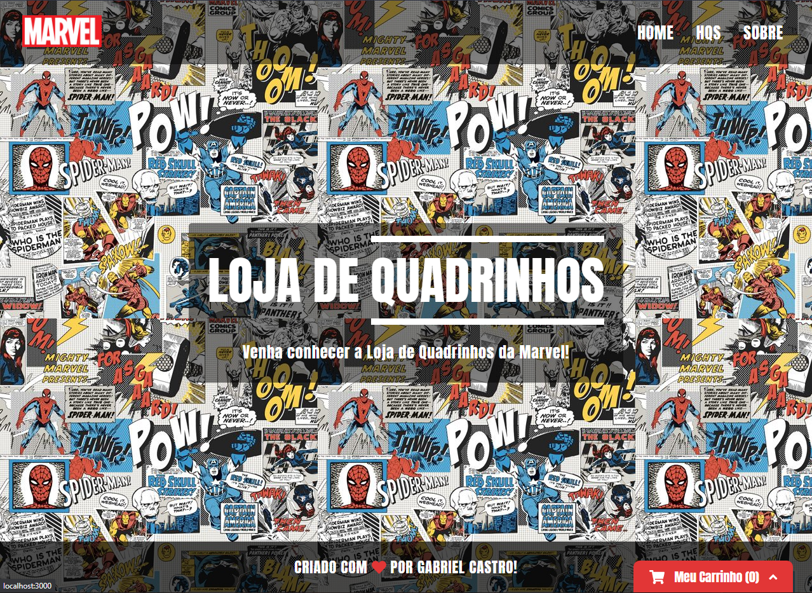
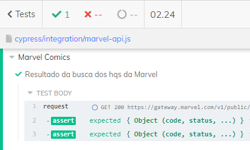

<h1 align="center">NeoApp | Marvel</h1>

### **Como rodar o projeto?**

Primeiramente, você vai precisar ter instalado a ferramenta git, para fazer o clone do repositório.

Dentro do bash do git, execute o seguinte comando: <br>

```
git clone https://github.com/gabrielcastr0/neoapp-marvel.git
```

Após clonar o projeto, entre dentro da pasta, abra ela na sua IDE de preferência, e execute o seguinte comando no terminal para instalar as dependências: <br>

```
yarn
```

E por fim, execute o seguinte comando para rodar a aplicação: <br>

```
yarn start
```

### **Site**

Link: https://neoapp-marvel.netlify.app/



### **Features**

- [X] Listagem das HQS
- [X] Listagem Individual das HQS
- [X] Paginação
- [X] Carrinho de compras
- [X] Responsividade

### **Tecnologias utilizadas**

- ReactJS
- Styled Components
- Redux
- React Router Dom
- Axios
- Font Awesome
- TypeScript
### **Deploy do Projeto**

[](https://app.netlify.com/sites/neoapp-marvel/deploys)

### **Testando a requisição com Cypress**



### **Inspirações**

Bom, após ler os desafios propostos e tecnologias que deveriam ser utilizadas, comecei a estruturar o que iria fazer. Fui testando maneiras diferentes de interface, até que chegasse em um ponto que me agradasse, pois sei que uma boa UI é de extrema importância. Sobre as partes funcionais do projeto (requisições, carrinho, etc), gostei bastante da experiência, pois acredito que pude colocar muitos conceitos em prática. 
Enfim, acredito que o resultado ficou bem legal, e espero que vocês gostem :)  
### **Autor**

 
 <br />

Feito com ❤️ por Gabriel Castro!

LinkedIn: https://www.linkedin.com/in/gabriel-castr0/ <br />
Portfólio: https://gabrielcastr0.github.io/portfolio-web/
